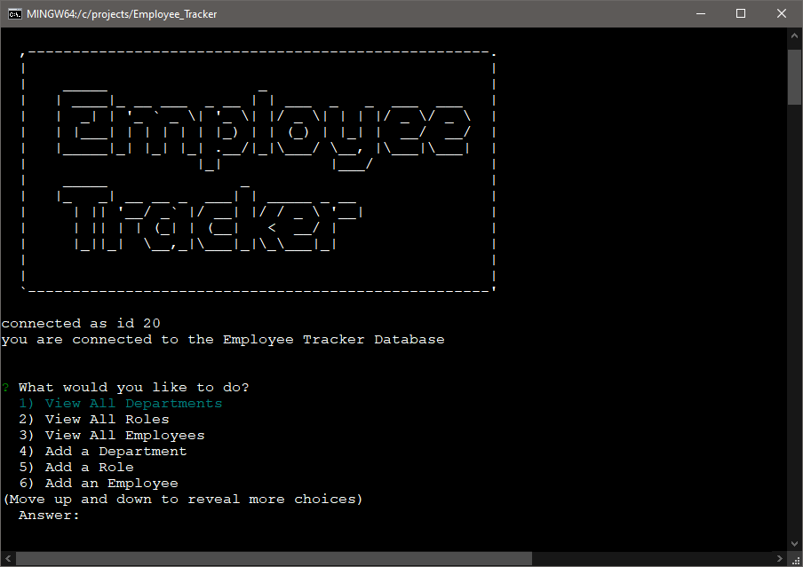

# EMPLOYEE TRACKER


  

 
 
  
 
 
 


 ## Table of Contents:  

[1. Description](#Description)  
[2. Acceptance Criteria](#Acceptance-Criteria)  
[3. Screen Shots](#Screen_Shots)  
[4. Installation](#Installation)  
[5. License Details](#License-Details)  
[6. Submission](#Submission)   
[7. Questions](#Questions)  

## Description:  

AS A business owner  
I WANT to be able to view and manage the departments, roles, and employees in my company  
SO THAT I can organize and plan my business

## Acceptance Criteria  

GIVEN a command-line application that accepts user input

WHEN I start the application  
THEN I am presented with the following options:
- `view all departments`
- `view all roles`
- `view all employees`
- `add a department`
- `add a role`
- `add an employee`
- `update an employee role`
---
WHEN I choose to `view all departments`  
THEN I am presented with a formatted table showing:  
- department names
- department ids
---
WHEN I choose to `view all roles`
THEN I am presented with the:
- job title
- role id
- department that role belongs to
- salary for that role
---
WHEN I choose to `view all employees`  
THEN I am presented with a formatted table showing employee data including:  
- employee ids 
- first names 
- last names 
- job titles
- departments
- salaries 
- managers that the employees report to
---
WHEN I choose to `add a department`  
THEN I am prompted to enter the name of the department and that department is added to the database  

---

WHEN I choose to `add a role`  
THEN I am prompted to enter the following for the role
- name 
- salary
- department  

The role is added to the database  

---
WHEN I choose to `add an employee`  
THEN I am prompted to enter the employee’s:  
- first name
- last name
- role id
- manager id  

and that employee is added to the database  

---
WHEN I choose to `update an employee role`  
THEN I am prompted to select an employee to update and their new role and this information is updated in the database 

## Screen Shots
  


## Installation
1. download the repo from the link below  
2. open a terminal window  
3. Run the following at the command line
```
    $ npm install
```
4. Start the app
```
    $ node index.js
```
5. follow the prompts 


## License Details  
This project is under no license

## Submission  
[Employee Tracker repository](https://github.com/civ187/Employee_Tracker)  
[Video Walkthrough](https://drive.google.com/file/d/1uJyvwPQZnD-aUDEsId7j7f7pfPwXVXw9/view)  

## Questions:  
 Here is a link to my github:  
https://github.com/civ187  
 Email me at:  
civ187@gmail.com  
for additional questions